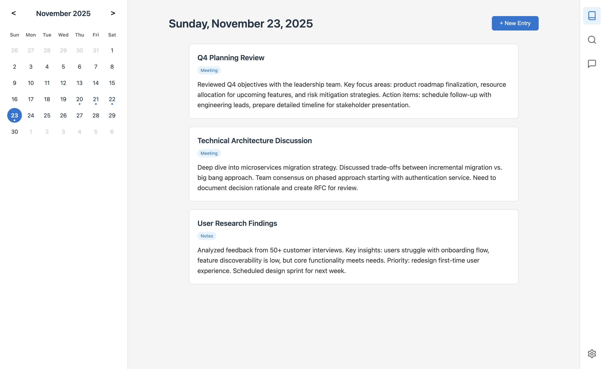
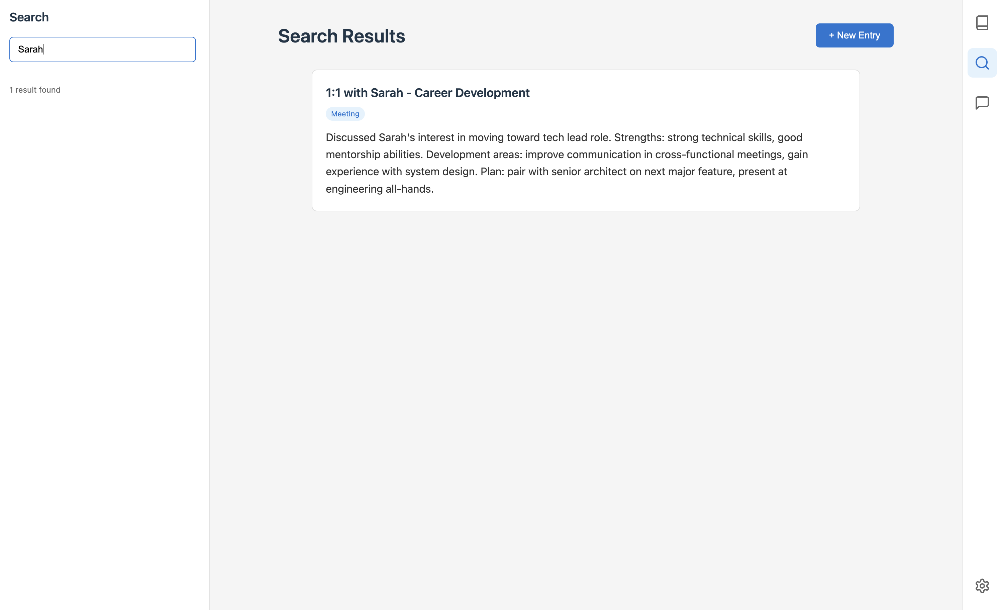
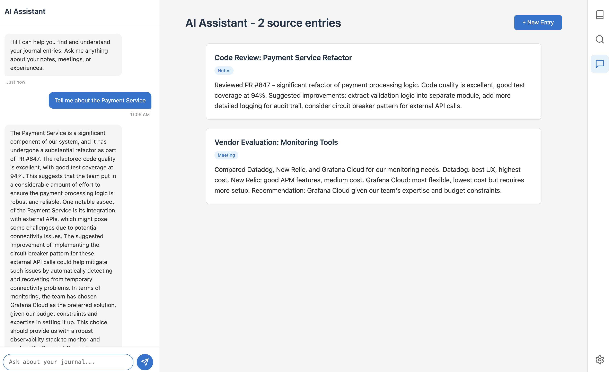

# 📓 Journal

> A clean, minimal digital journal that feels like writing in a physical notebook — quiet, private, and free from clutter.

[](https://github.com/chrisbakker/journal)
[](https://go.dev)
[](https://www.typescriptlang.org/)
[](https://www.postgresql.org/)
[](LICENSE)

---

## 🎯 What is Journal?

Journal is a **personal knowledge companion** that combines the simplicity of pen and paper with the power of AI. It's designed for professionals who want to:

- **📝 Capture thoughts quickly** without fighting with complex interfaces
- **🔍 Find anything instantly** using natural language search
- **💬 Chat with your past self** through AI-powered conversations with your entries
- **🏃 Move fast** with auto-save, keyboard shortcuts, and zero friction

Think of it as your **personal wiki meets daily journal**, enhanced with AI that actually understands context.

---

## ✨ Screenshots

### 📅 Daily Entries
Beautiful calendar-based navigation with rich text editing and auto-save.



### 🔍 Smart Search
Find anything across all your entries with full-text search.



### 💬 AI Chat
Ask questions about your entries. Get insights from your own notes.



---

## 🚀 Key Features

### **📅 Calendar-First Design**
Organize by days, not folders. Navigate naturally through time.

### **✍️ Rich Text Editing**
Format your thoughts with a clean WYSIWYG editor. Tables, lists, headings — all supported.

### **💾 Auto-Save Everything**
Changes save automatically every 2 seconds. Never lose your work.

### **🔍 Full-Text Search**
Find any entry instantly by searching titles, content, or attendees.

### **💬 AI-Powered Chat**
Ask questions about your notes. "What did I discuss with Sarah last month?" Get answers from your own journal.

### **📎 Attachments**
Store files and images alongside your entries.

### **🔐 Fully Self-Hosted**
Your data stays on your machine. No cloud, no tracking, no subscriptions.

### **⚡ Zero Configuration**
Web-based setup wizard gets you running in minutes.

---

## 🏗️ Tech Stack

Built with modern, battle-tested technologies:

- **Backend**: Go 1.22+ with Gin framework
- **Frontend**: TypeScript + Vite + Quill 2.0
- **Database**: PostgreSQL 16 + pgvector
- **AI**: Ollama (local LLMs)
- **Search**: Full-text search + vector similarity
- **Rich Text**: Quill 2.0 with Delta format

---

## 🎯 Who Is This For?

Journal is perfect for:

- **👨‍💼 Engineering Managers** tracking 1:1s, decisions, and team notes
- **🔬 Researchers** organizing thoughts and connecting ideas
- **📚 Students** keeping study notes and project logs
- **✍️ Writers** capturing ideas and building a personal knowledge base
- **🧑‍💻 Developers** maintaining technical journals and decision logs

If you value **privacy, speed, and AI assistance** without giving up control of your data, Journal is for you.

---

## 🚦 Quick Start

### Prerequisites

- **Go 1.22+**
- **PostgreSQL 16+** with pgvector extension
- **Ollama** (for AI features)
- **Node.js 18+** (for building frontend)
- **Docker or Podman** (optional, for database)

### Installation

1. **Clone the repository**
   ```bash
   git clone https://github.com/chrisbakker/journal.git
   cd journal
   ```

2. **Set up the database**
   
   ```bash
   # Set up PostgreSQL with pgvector
   ./scripts/setup-database.sh
   ```
   
   See [scripts/README.md](scripts/README.md) for database configuration options.

3. **Install Ollama and pull models**
   ```bash
   # Install Ollama (see https://ollama.ai)
   ollama pull nomic-embed-text
   ollama pull llama3.2
   ```

4. **Build and run**
   
   **Option A: Run locally**
   ```bash
   make run
   ```
   
   **Option B: Run in Docker**
   ```bash
   docker compose up -d
   ```
   
   See [docs/DOCKER.md](docs/DOCKER.md) for Docker deployment details.

5. **Open your browser**
   ```
   http://localhost:8080
   ```

6. **Complete the setup wizard**
   - Configure Ollama URL and models
   - Start journaling!

---

## 📖 Documentation

- **[Development Guide](docs/DEVELOPMENT.md)** - Full setup and development instructions
- **[Technical Specification](docs/TECH-SPEC.md)** - Architecture and design decisions
- **[Product Overview](docs/PRODUCT.md)** - Features and roadmap

---

## 🤝 Contributing

Contributions are welcome! Whether it's:

- 🐛 Bug reports
- 💡 Feature requests
- 📝 Documentation improvements
- 🔧 Code contributions

Please feel free to open an issue or submit a pull request.

### Development Workflow

```bash
# Run with hot reload
make run

# Run tests
make test

# Build production binary
make build
```

See [docs/DEVELOPMENT.md](docs/DEVELOPMENT.md) for detailed development instructions.

---

## 🗺️ Roadmap

### ✅ Phase 1: Core Journal (Complete)
- Calendar-based navigation
- Rich text editing with auto-save
- Entry types and attendees
- Attachments

### ✅ Phase 2: Search (Complete)
- Full-text search across all entries
- Filter by entry type

### ✅ Phase 3: AI & RAG (Complete)
- AI-powered chat with your journal
- Vector similarity search
- Context-aware responses

### 🔮 Phase 4: Enhancements (Planned)
- Tags and categories
- Daily/weekly summaries via AI
- Export to Markdown/PDF
- Mobile-responsive design
- Themes and customization

---

## 💡 Philosophy

Journal is built on three core principles:

1. **🔐 Privacy First** - Your data belongs to you. Self-hosted, no cloud required.
2. **⚡ Speed Matters** - Fast to write, fast to search, fast to recall.
3. **🤖 AI as Assistant** - AI enhances your thinking, doesn't replace it.

---

## 📄 License

MIT License - see [LICENSE](LICENSE) for details.

---

## 🙏 Acknowledgments

Built with amazing open-source tools:

- [Quill](https://quilljs.com/) - Rich text editor
- [Ollama](https://ollama.ai/) - Local LLM runtime
- [pgvector](https://github.com/pgvector/pgvector) - Vector similarity search for PostgreSQL
- [Gin](https://gin-gonic.com/) - Go web framework
- [sqlc](https://sqlc.dev/) - Type-safe SQL in Go

---

## 📬 Contact

Questions? Ideas? Found a bug?

- **Issues**: [GitHub Issues](https://github.com/chrisbakker/journal/issues)
- **Discussions**: [GitHub Discussions](https://github.com/chrisbakker/journal/discussions)

---

<div align="center">

**Made with ❤️ for people who think in writing**

[⭐ Star this repo](https://github.com/chrisbakker/journal) if you find it useful!

</div>

